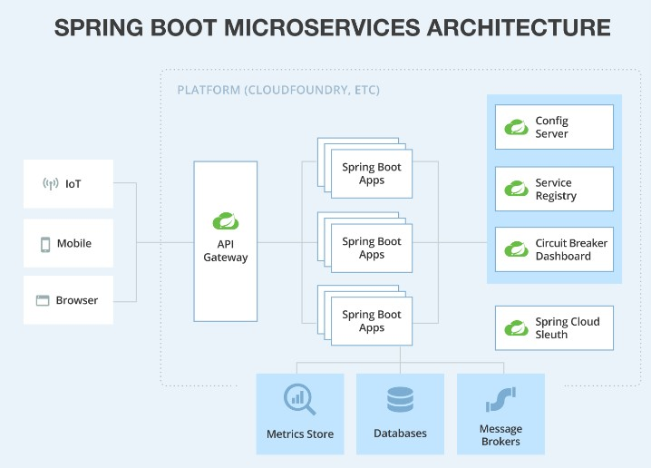

# MICROSERVICES

This is a project on studying microservices in Java and their interaction with each other.

It involves exploring technologies, modules' interactions, and configuring them from a remote repository.

